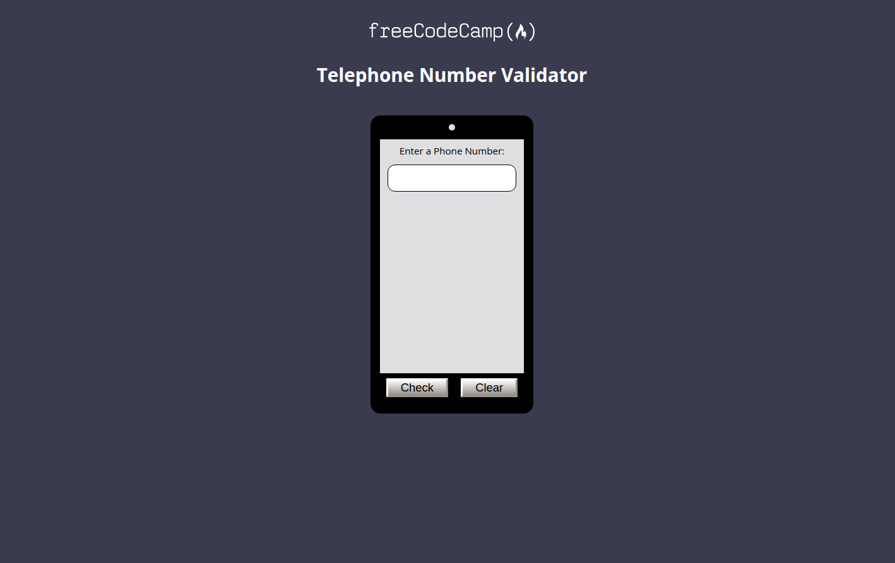

# Project Name

> This project was created with the aim of obtaining a Telephone Number Validator and the goal of obtaining freeCodeCamp certification.

        

With this phone number validator you can find out if a number complies with the American numeric format.

## Built With

- HTML5
- CSS3
- javascript
- visualstudiocode
- git
- github

## Live Demo

[Live Demo Link](https://aristides1000.github.io/Telephone-Number-Validator-Project---freeCodeCamp/)

## Getting Started

To get a local copy up and running follow these simple example steps.

### Prerequisites

Have an internet connection when downloading the project

### Setup

### Install

### Usage

Open the index.html file to see the project in action

### Run tests

### Deployment

## Authors

👤 **Arístides José Molina Pérez**

- GitHub: [@aristides1000](https://github.com/aristides1000)
- Twitter: [@aristides_1000](https://twitter.com/aristides_1000)
- LinkedIn: [LinkedIn](https://www.linkedin.com/in/aristides-molina/)

## 🤝 Contributing

Contributions, issues, and feature requests are welcome!

Feel free to check the [issues page](../../issues/).

## Show your support

Give a ⭐️ if you like this project!

## Acknowledgments

- My Family
- Microverse
- freeCodeCamp
- The Odin Project

## 📝 License

This project is [CC0 1.0 Universal](LICENSE) licensed.
